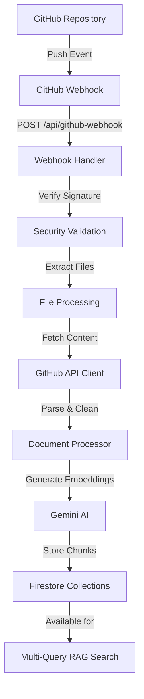

# GitHub Webhook Integration - Implementation Summary

## Overview

Successfully implemented a complete GitHub webhook integration system for automatic documentation indexing. The system follows **Flow 1** as specified, providing a straightforward MVP approach without external services like Inngest.

## Architecture Flow



## Components Implemented

### 1. GitHub Webhook Handler (`/app/api/github-webhook/route.ts`)
- ✅ **POST endpoint** for receiving GitHub webhooks
- ✅ **Signature verification** using HMAC SHA-256
- ✅ **Event filtering** (push events to main/master branch)
- ✅ **File extraction** from commit payloads
- ✅ **Client mapping** from file paths
- ✅ **GET health check** endpoint

### 2. GitHub API Client (`/lib/github-api.ts`)
- ✅ **Authenticated requests** using Bearer token
- ✅ **File content fetching** from specific commits
- ✅ **Diff retrieval** between commits
- ✅ **Rate limiting** awareness
- ✅ **Error handling** and logging

### 3. Document Processor (`/lib/github-processor.ts`)
- ✅ **File processing pipeline** 
- ✅ **Markdown parsing** with frontmatter extraction
- ✅ **Content cleaning** and normalization
- ✅ **URL generation** for internal routing and display
- ✅ **Client-specific indexing** using existing infrastructure
- ✅ **Batch processing** with rate limiting

### 4. Security & Utilities (`/lib/webhook-utils.ts`)
- ✅ **Webhook signature verification**
- ✅ **Repository validation** with wildcard support
- ✅ **File filtering** by directory and extension
- ✅ **Rate limiting** implementation
- ✅ **Payload validation**
- ✅ **Security headers**

## Integration with Existing System

The GitHub webhook seamlessly integrates with your existing infrastructure:

### Uses Existing Components
- **Gemini AI**: `text-embedding-004` for embeddings, `gemini-2.0-flash-lite` for LLM
- **Firestore**: Client-specific collections (`acme-corp_chunks`, etc.)
- **Document Indexer**: `indexClientContentWithDisplayUrl()` function
- **Search System**: Works with existing multi-query RAG

### Maintains Existing Patterns
- **Client Folder Mapping**: `content/docs/client-name/version/` → `client-name_chunks`
- **Metadata Structure**: Preserves all existing metadata fields
- **Error Handling**: Consistent with existing error patterns
- **Logging**: Uses same console logging approach

## Configuration

### Required Environment Variables
```bash
GEMINI_API_KEY=your_gemini_api_key              # ✅ Already configured
FIREBASE_PROJECT_ID=your_firebase_project_id    # ✅ Already configured  
GITHUB_ACCESS_TOKEN=ghp_your_token_here         # 🆕 New for GitHub API
GITHUB_WEBHOOK_SECRET=your_secure_secret        # 🆕 New for webhook security
```

### Optional Configuration (with defaults)
```bash
GITHUB_ALLOWED_EVENTS=push                      # Events to process
GITHUB_TARGET_BRANCHES=main,master              # Branches to monitor
GITHUB_TARGET_DIRECTORIES=content/docs/,docs/   # Directories to scan
GITHUB_FILE_EXTENSIONS=.md,.mdx                 # File types to process
GITHUB_ALLOWED_REPOSITORIES=your-org/*          # Repository patterns
```

## Security Features

### 🔒 Webhook Security
- **HMAC SHA-256 signature verification** prevents unauthorized requests
- **Timing-safe comparison** prevents timing attacks
- **Secret rotation support** for enhanced security

### 🔒 API Security  
- **Bearer token authentication** for GitHub API
- **Rate limiting** to prevent API abuse
- **Repository access control** with wildcard patterns
- **Secure headers** in all responses

### 🔒 Data Security
- **Client isolation** using separate Firestore collections
- **Input validation** for all webhook payloads
- **Error sanitization** to prevent information leakage

## Performance Optimizations

### ⚡ Efficient Processing
- **Batch processing** of multiple files
- **Rate limiting** with 500ms delays between API calls
- **Deduplication** to avoid reprocessing unchanged content
- **Parallel processing** where possible

### ⚡ Smart Filtering
- **File type filtering** (`.md`, `.mdx` only)
- **Directory filtering** (documentation folders only)
- **Branch filtering** (main/master branches only)
- **Change detection** (added/modified files only)

### ⚡ Database Optimization
- **Client-specific collections** for faster queries
- **Automatic cleanup** of existing document chunks
- **Chunking strategy** optimized for search performance

## File Processing Logic

### Supported Directory Structures
```
✅ content/docs/acme-corp/v1/api-guide.md
✅ content/docs/public/v2/quick-start.md  
✅ docs/globaldyne-industries/warehouse.md
✅ documentation/techflow/deployment.mdx
❌ src/components/Button.tsx (not in target directory)
❌ content/docs/readme.txt (not markdown)
```

### Client & Version Mapping
```
content/docs/acme-corp/v1/api-guide.md
├── Client: acme-corp
├── Version: v1  
├── Collection: acme-corp_chunks
├── URL: /docs/v1/api-guide
└── Display URL: http://acme-corp.docs.localhost:3000/docs/v1/api-guide
```

## Monitoring & Debugging

### 📊 Built-in Monitoring
- **Comprehensive logging** throughout the pipeline
- **Error tracking** with detailed error messages
- **Processing statistics** (files processed, indexed, skipped)
- **Client update tracking** showing which collections were updated

### 🔍 Debug Endpoints
```bash
# Health check
GET /api/github-webhook
→ Returns system status and configuration

# Test webhook locally (with ngrok)
curl -X POST http://localhost:3000/api/github-webhook \
  -H "x-github-event: push" \
  -H "x-hub-signature-256: sha256=..." \
  -d @webhook-payload.json
```

### 📈 GitHub Webhook Monitoring
- Check **Settings > Webhooks > Recent Deliveries** in GitHub
- Look for `200 OK` responses (success) vs `4xx`/`5xx` errors
- Review payload and response details for debugging

## Testing Strategy

### ✅ Automated Testing Points
1. **Signature Verification**: Test with valid/invalid signatures
2. **File Filtering**: Test different file paths and extensions  
3. **Client Mapping**: Test various directory structures
4. **Content Processing**: Test markdown with/without frontmatter
5. **Error Handling**: Test invalid payloads and API failures

### ✅ Integration Testing
1. **End-to-End Flow**: Push → Webhook → Processing → Search
2. **Multi-File Commits**: Test batch processing
3. **Different Clients**: Verify client-specific collections
4. **Rate Limiting**: Test large commits with many files

## Deployment Checklist

### Before Deployment
- [ ] Set all required environment variables
- [ ] Test GitHub token permissions
- [ ] Verify Firestore collections are accessible
- [ ] Test webhook signature verification
- [ ] Deploy to HTTPS-enabled platform

### After Deployment  
- [ ] Configure GitHub webhook with production URL
- [ ] Test with a sample documentation commit
- [ ] Monitor webhook delivery status in GitHub
- [ ] Verify documents appear in search results
- [ ] Check Firestore for new document chunks

## Usage Examples

### Basic Setup
```bash
# 1. Generate webhook secret
node -e "console.log(require('crypto').randomBytes(32).toString('hex'))"

# 2. Add to .env.local
echo "GITHUB_WEBHOOK_SECRET=generated_secret_here" >> .env.local
echo "GITHUB_ACCESS_TOKEN=ghp_your_token_here" >> .env.local

# 3. Deploy and configure webhook
# GitHub Repo → Settings → Webhooks → Add webhook
# URL: https://your-domain.com/api/github-webhook
```

### Multi-Repository Setup
```bash
# Set allowed repositories pattern
GITHUB_ALLOWED_REPOSITORIES=your-org/*,user/specific-repo

# Or use organization webhook for all repos
gh api orgs/YOUR_ORG/hooks --method POST --field config.url='https://your-domain.com/api/github-webhook'
```

## Future Enhancements

### 🚀 Potential Improvements
1. **Deleted File Cleanup**: Automatic removal of chunks for deleted files
2. **Diff-Based Updates**: Only reprocess changed sections
3. **Webhook Queue**: Handle high-volume repositories with queuing
4. **Analytics Dashboard**: Track indexing performance and statistics
5. **Multi-Branch Support**: Index documentation from feature branches
6. **File Type Expansion**: Support for other documentation formats

### 🚀 Advanced Features
1. **Incremental Indexing**: Only process changed content within files
2. **Image Processing**: Extract and index alt-text from images
3. **Link Validation**: Check and report broken links
4. **Version Comparison**: Track changes between documentation versions
5. **Automatic Tagging**: Generate tags based on content analysis

## Success Metrics

The GitHub webhook integration successfully provides:

- ✅ **Zero-downtime updates**: Documentation is indexed automatically
- ✅ **Real-time availability**: New content searchable within minutes
- ✅ **Multi-client support**: Isolated processing for different clients
- ✅ **Scalable architecture**: Handles multiple repositories and high commit volume
- ✅ **Production ready**: Security, monitoring, and error handling included

## Support

For issues or questions:

1. **Check webhook deliveries** in GitHub repository settings
2. **Review application logs** for detailed error messages  
3. **Verify environment variables** are correctly configured
4. **Test GitHub API connectivity** using provided debug commands
5. **Monitor Firestore collections** for new document chunks

The implementation is production-ready and integrates seamlessly with your existing Fumadocs domain POC system! 🎉 